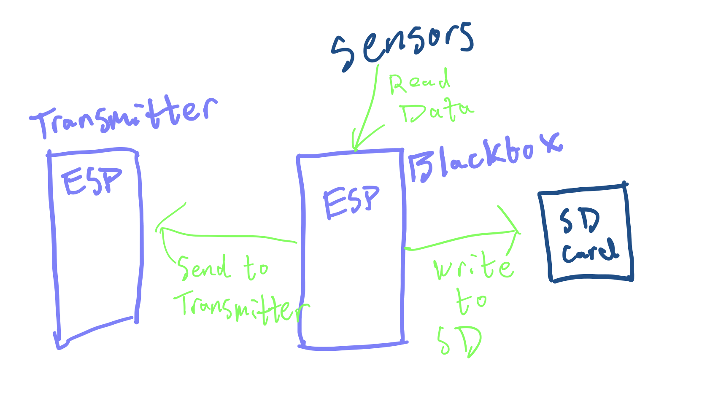

# Blackbox Code

The prime functionality of the BlackBox esp32 is to collect data, write this data to an SD card, and send this data to the transmitter esp32.

Sensors:
BMP390 : Temperature, Pressure, Humidity, Altitude
BNO055 : 9-axis Orientation
GPS : Breakout board
SD : Breakout board

